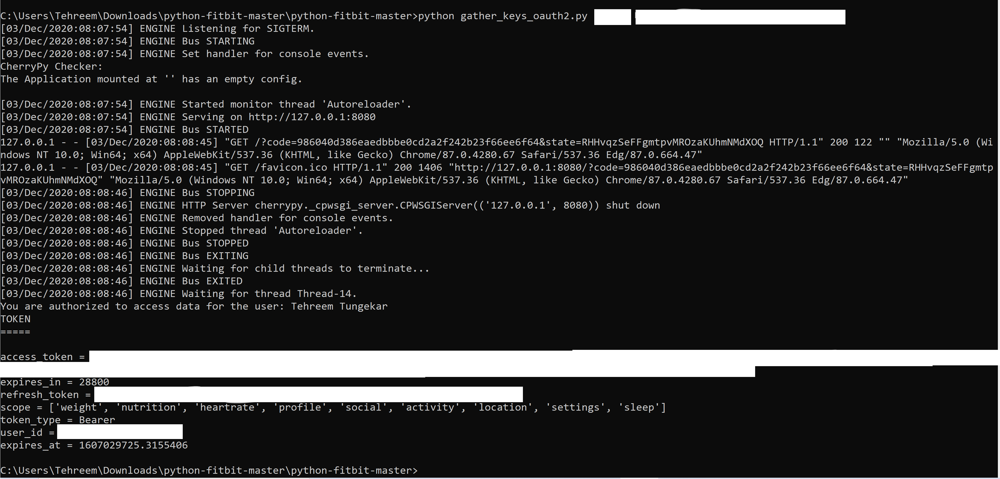

Project Title: "Using Fitbit's API to Acquire, Visualize, and Analyze Data in Python"

Fitbit provides a Web API to access data from Fitbit activity trackers, Aria & Aria 2 scales, or manually entered logs.
Fitbit API (https://dev.fitbit.com/build/reference/web-api/basics/) can be used to get your own data.

Step 1: Create your [Fitbit account](https://accounts.fitbit.com/signup?targetUrl=https%3A%2F%2Fwww.fitbit.com%2Flogin%2Ftransferpage%3Fredirect%3Dhttps%253A%252F%252Fwww.fitbit.com&lcl=en_US):

Enter all your information like Name, Date of birth, height, weight and click on "Join Fitbit".

Step 2: Set up your account by verifying your email. Go to your Dashboard:

Go to https://dev.fitbit.com/
Go to “Manage” and click on “Register An App":

Fill in all the details on the Registration page:

The next page will have all your details like OAuth Client ID and Client Secret.
I have hidden those details for security reasons.

Step 3: Install the Fitbit API Python Library:

Navigate to https://github.com/orcasgit/python-fitbit and install fitbit python library by downloading the zip file and running the following command on your terminal.
cd to your path which contains the downloaded zip file and type:

~sudo pip install -r requirements/base.txt

Once this step is done, you can start writing your code using fitbit api library.

Step 4: Role of OAuth in Authorization:
Once fitbit API library is installed from the previous step, now the only thing thats remaining is getting access token and refresh token to keep on refreshing that access token. 
Access tokens are like temporary keys which are asigned so that you can access a specific set of resources for a specific period of time. You can only get these tokens when you have convinced the Fitbit server that you are who you say you are! i.e. authenticated yourself successfully. 
So, to get these access tokens, navigate to file named gather_keys_oauth2.py which can be found in the python folder that we downloaded in the previous step. Go to cmd and type ther following command (Remember to put your own Client Id and Client secret which you obtained in step 1):

~python gather_keys_oauth2.py <"CLIENT ID"> <"CLIENT SECRET"> 

You would be automatically redirected to the fitbit Authentication page where it would ask you to authenticate yourself(by providing your username & password). Then, you will be asked to select the resources you want the program to access. I have selected all resources as can be seen below:

Once successfully authenticated (ONLY after successful authentication), you will see the tokens in your terminal(Hidden for security). 
'expires_in' denotes when the token is set to expire;
'refresh_token' is the token which would be used to refresh our access token (when it expires);
'scope' denotes all the fields it would have access to. Notice that this is the same as I selected in the previous step.

Step 5: Run collect_data.py program in your terminal window by typing python3 collect_data.py:
The .csv files would be generated.

Step 6: Run analyze.py in your terminal window by typing python3 analyze.py:

i. The first pie chart with Activity Distribution will be generated:

ii. The following graphs show distance distribution for three months, namely, June, July and August 2020:

  a. Distance distribution for the month of June:
  
  
  
  b. Distance distribution for the month of July:
  
  
  
  c. Distance distribution for the month of August:
  
  

