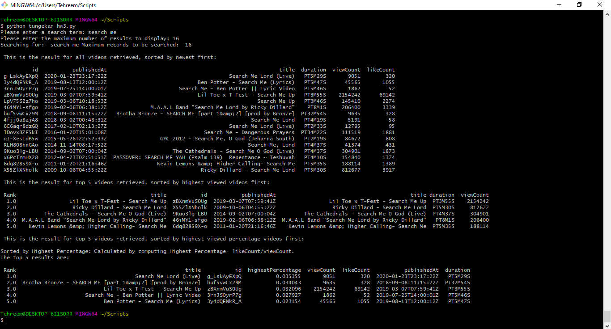

1. Create a YouTube Developer account and get credentials.

2. Use those credentials to access or retrieve data from the YouTube API.

3. In "API_KEY" field, put your API Key.

4. Output of the program:

