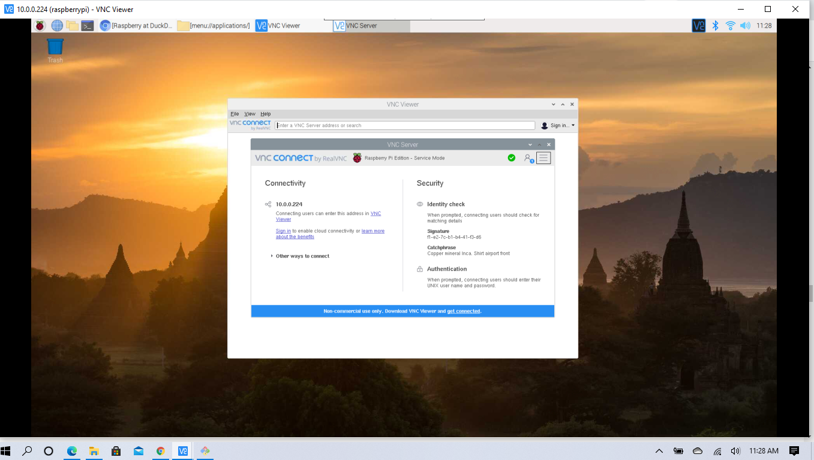
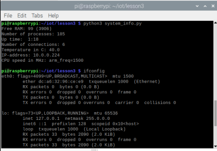
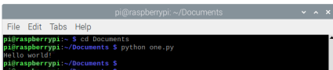

Lab 2

1. Open VNC Connect on Raspberry Pi and select VNC Server(After enabling it in Raspberry Pi's Configurations)

2. This will show the ip address of your Raspberry Pi:

3. Run a simple python program on Raspberry Pi:

