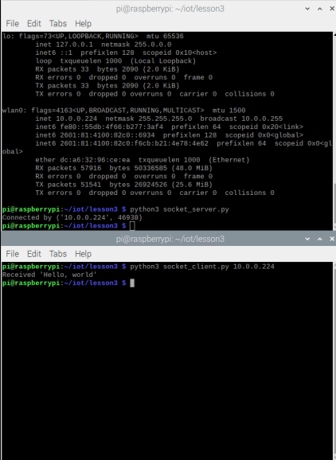

Lab 3:

1. Upgraded the python to latest version on Raspberry Pi:

2. Executed some python scripts from Dr. Lu's GitHub repository:

3. Simple python program to demonstrate Client Server Python Socket Programming on Raspberry Pi:

