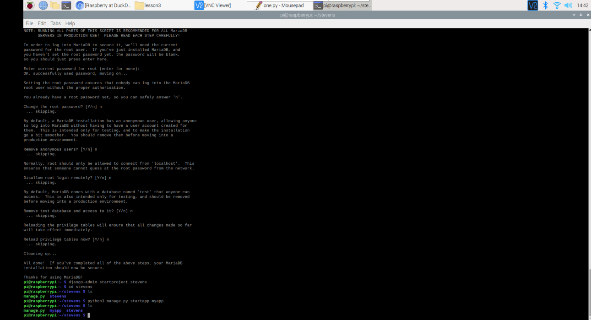
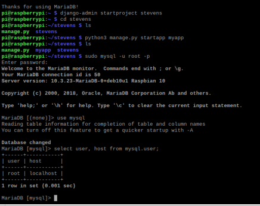
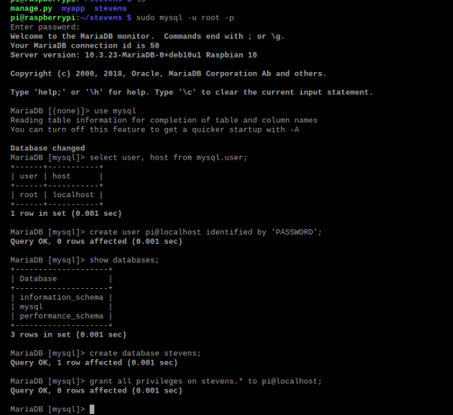
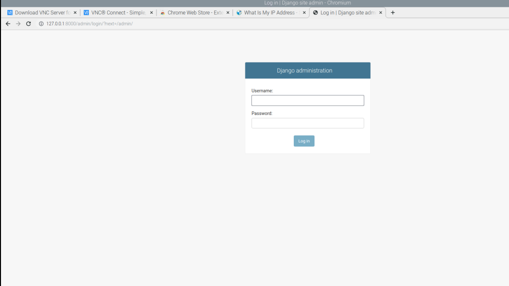

Lab 4

In this lab, we will be installing Django and Flask.

1. Using guidelines and steps from Dr. Lu's GitHub repository, install Django and Django REST Framework, also install MariaDB and start project mystevens:

2. Then execute the commands for database:

3. After myapp has been loaded and server is running, go to your Web Browser and type http://127.0.0.1:8000/admin
Your server should be up and running at http://127.0.0.1:8000

