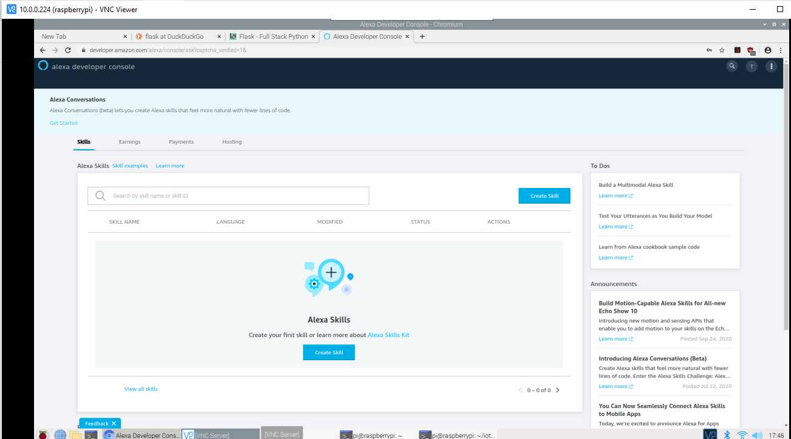
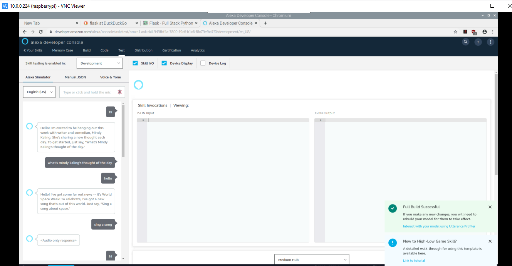

Lab 4

In this lab, we will be installing Django and Flask.

1. Using guidelines and steps from Dr. Lu's GitHub repository, install Django and Django REST Framework, also install MariaDB and start project mystevens:

2. Then execute the commands for database:

3. After myapp has been loaded and server is running, go to your Web Browser and type http://127.0.0.1:8000/admin
Your server should be up and running at http://127.0.0.1:8000

4. Installed Flask:

Also install ngrok:

5. Sign up on Alexa Developer Account:

6. Screen showing Alexa Developer Console:

7. Created an Alexa Game from one of the sample templates available:

8. You can experiment on Alexa by using various sample templates available:

9. Lab 4D: 
Installing Apache HTTP Server and PHP:

10. After copying index file from Dr. Lu's repository in /var/www/html,
go to Web Chromium and the following Hello World page would be displayed:

11. Install Wordpress:

Go to web chromium and check if Wordpress was installed correctly:

