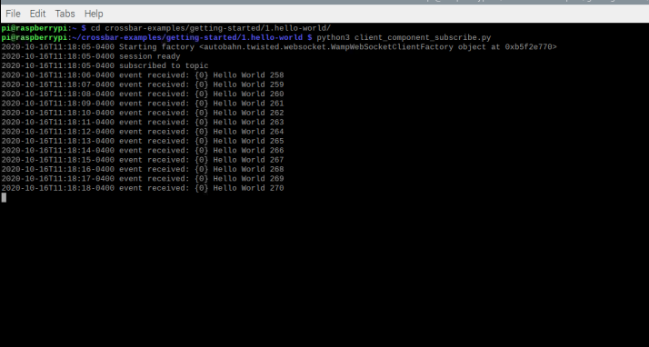
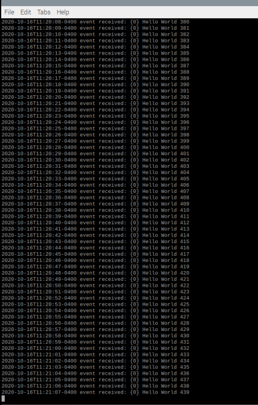

Lab 5:

1. Install Docker on Raspberry Pi:
We use curl command for installing Docker container.

2. Add Pi to the Docker group as a non-root user by giving the command like:

You should press Ctrl+D to logout and then again log-in by SSH for this to take effect.

3. Run Docker images designed to work on ARM under the prefix armhf:

4. Build and run new Docker Image from Docker file:

Make sure you create a directory named demo and then copy the file Dockerfile from Dr. Lu's repo.

5. Once step 4 has been successfully executed, you can verify it using docker images command and you would get a list of all images:

6. Next part of the lab focusses on: 

Run Crossbar.io router on Terminal 1
Navigate to a new terminal, and execute the following commmands:
$ git clone https://github.com/crossbario/crossbar-examples
$ cd crossbar-examples/getting-started
$ docker pull crossbario/crossbar-armhf
$ docker run -v $PWD:/node -u 0 --rm --name=crossbar -it -p 8080:8080 crossbario/crossbar-armhf

Do not close this terminal

7. On a new terminal, let us call this our terminal 2, using this command pip install autobahn:
$ sudo pip3 install -U autobahn[twisted,encryption,serialization,xbr]

Navigate to the directory and run the client publish python file:
$ cd crossbar-examples/getting-started/1.hello-world/
$ python3 client_component_publish.py

Do not close this terminal

8. Now that our publisher is ready, navigate to a new terminal, let us call it terminal 3. 
We will run our client subscriber on this terminal:
First change the directory and then run the subscriber code:

$ cd crossbar-examples/getting-started/1.hello-world/
$ python3 client_component_subscribe.py

Note that the first 257 messages are lost because I subscribed after the first 257 messages were published. 

8. Now, if I stop the publisher, my subscriber will not receive messages:
Stop publisher:

Now the subscriber does not receive messages:

Moving on to the next part of the lab:
Lab 5B: Eclipse Mosquitto and Eclipse Paho

1. Install mosquitto and run subscriber:

$ sudo apt install mosquitto mosquitto-clients
$ mosquitto_sub -h localhost -v -t "\$SYS/#"

Stop subscriber by pressing Ctrl-C

2. Install Paho and publish "Hello" on new terminal:

$ mosquitto_pub -h localhost -t test/topic -m "Hello"
$ service mosquitto status
$ netstat -tln
$ sudo pip3 install -U paho-mqtt
$ git clone https://github.com/eclipse/paho.mqtt.python.git
$ cd ~/iot/lesson5
$ python3 client.py

3. Exit and open a new terminal to run subscriber first:
$ python3 sub.py

Now open a new terminal and run publisher:
$ python3 pub.py

4. Exit by pressing Ctrl-C and run multiple pub sub programs on different terminals:

5. Again exit by pressing Ctrl-C and run the next programs to publish and subscribe to raspberry pi's temperature and CPU usage data:

![raspipubsub.PNG)
